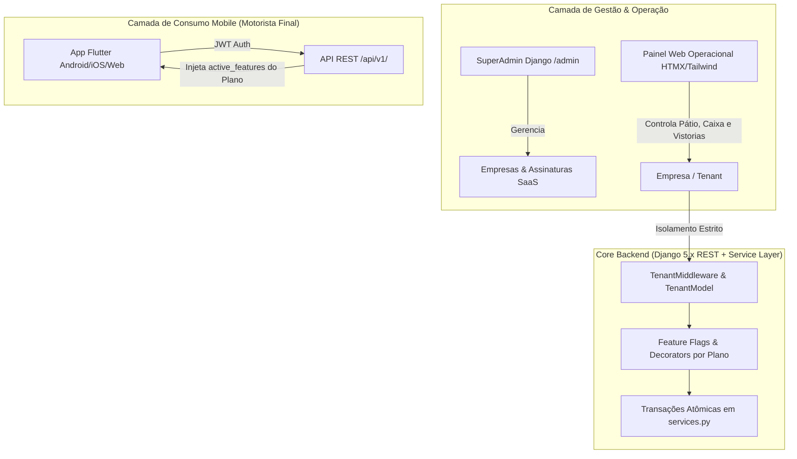

# 🚀 GUIA MESTRE DE CONSTRUÇÃO DO PROJETO DO ZERO
## Plataforma SaaS Multi-Tenant para Lava-Jato & Estética Automotiva com App Mobile Flutter

> **Sobre este documento:** Este guia foi gerado a partir da análise detalhada da arquitetura deste projeto. Ele contém todas as especificações de engenharia, modelos relacionais, regras de negócio atômicas, contratos de API REST, front-end web reativo com HTMX e o aplicativo mobile em Flutter, permitindo recriar toda a infraestrutura e código a partir do zero absoluto.

---

## 📑 Sumário

1. [Visão Geral e Arquitetura do Sistema](#1-visão-geral-e-arquitetura-do-sistema)
2. [Matriz de Monetização e Planos do SaaS](#2-matriz-de-monetização-e-planos-do-saas)
3. [Estrutura de Pastas e Diretórios do Repositório](#3-estrutura-de-pastas-e-diretórios-do-repositório)
4. [Fase 1: Configuração do Ambiente e Django Base](#4-fase-1-configuração-do-ambiente-e-django-base)
5. [Fase 2: Motor Multi-Tenant e Controle de Planos (`saas_core`)](#5-fase-2-motor-multi-tenant-e-controle-de-planos-saas_core)
6. [Fase 3: Autenticação Customizada e Perfis de Usuário (`accounts`)](#6-fase-3-autenticação-customizada-e-perfis-de-usuário-accounts)
7. [Fase 4: Módulos Operacionais de Domínio](#7-fase-4-módulos-operacionais-de-domínio)
   - 7.1. Clientes e Veículos (`customers`)
   - 7.2. Catálogo de Serviços (`services`)
   - 7.3. Ordens de Serviço e Pátio (`orders`)
   - 7.4. Livro Caixa e Gestão Financeira (`finance`)
   - 7.5. Clube de Fidelidade (`loyalty`)
   - 7.6. Faturamento Mensal para Frotas (`billing`)
   - 7.7. Agendamentos Online (`appointments`)
   - 7.8. Comissões de Operadores (`commissions`)
8. [Fase 5: A Camada de Serviços (Service Layer Crítica)](#8-fase-5-a-camada-de-serviços-service-layer-crítica)
9. [Fase 6: Interface Web com Django + HTMX e Tailwind CSS](#9-fase-6-interface-web-com-django--htmx-e-tailwind-css)
10. [Fase 7: API RESTful JWT para Integração Mobile (`api`)](#10-fase-7-api-restful-jwt-para-integração-mobile-api)
11. [Fase 8: Aplicativo Mobile Flutter Dinâmico por Plano (`mobile_app`)](#11-fase-8-aplicativo-mobile-flutter-dinâmico-por-plano-mobile_app)
12. [Fase 9: Script de Carga Inicial (`seed_data.py`)](#12-fase-9-script-de-carga-inicial-seed_datapy)
13. [Fase 10: Testes Automatizados com Pytest](#13-fase-10-testes-automatizados-com-pytest)
14. [Fase 11: Containerização Docker & Produção](#14-fase-11-containerização-docker--produção)
15. [Checklist Final de Execução e Homologação](#15-checklist-final-de-execução-e-homologação)

---

## 1. Visão Geral e Arquitetura do Sistema

O ecossistema é composto por 3 camadas integradas:



### Princípios Chave de Arquitetura:
1. **Multi-Tenancy por Coluna Discriminadora (`TenantModel`):** Banco relacional compartilhado (PostgreSQL/SQLite) onde toda entidade de empresa herda de `TenantModel` contendo `company_id`.
2. **Camada de Serviços (Service Layer):** Regras de negócio que tocam múltiplos modelos residem estritamente em arquivos `services.py` dentro de blocos `with transaction.atomic()`, nunca misturadas em views ou métodos `save()` de modelos.
3. **Resolução Lazy de Dependências Circulares:** Para evitar ciclos entre `orders ↔ finance ↔ loyalty ↔ billing`, importações de serviços irmãos são feitas dentro das funções que as invocam.
4. **Interface Dinâmica por Plano:** O cliente motorista e o operador web têm recursos visíveis condicionados às *feature flags* ativas do plano contratado pela empresa.

---

## 2. Matriz de Monetização e Planos do SaaS

Os 3 planos comerciais que regem o comportamento da plataforma:

| Recurso / Feature Flag | Básico (Start)<br>**R$ 39,90/mês** | Profissional (Pro)<br>**R$ 79,90/mês** | Premium (Master)<br>**R$ 139,90/mês** |
| :--- | :---: | :---: | :---: |
| **Limite de Operadores** | 1 usuário | Até 3 usuários | Ilimitados (10+) |
| **Cadastro Clientes & Veículos** | ✅ | ✅ | ✅ |
| **Emissão de OS & Kanban Pátio** | ✅ | ✅ | ✅ |
| **Livro Caixa Básico** | ✅ | ✅ | ✅ |
| **Agendamento pelo App** | ✅ | ✅ | ✅ |
| **Programa de Fidelidade Digital** (`has_loyalty`) | ❌ | ✅ | ✅ |
| **Faturamento Mensal p/ Frotas** (`has_monthly_billing`) | ❌ | ✅ | ✅ |
| **Vistoria com Fotos Antes/Depois** (`has_inspections`) | ❌ | ❌ | ✅ |
| **Comissões de Funcionários** (`has_commissions`) | ❌ | ❌ | ✅ |
| **Notificações Push no App** (`has_push_notifications`) | ❌ | ❌ | ✅ |
| **Relatórios Gerenciais Avançados (DRE)** (`has_custom_reports`) | ❌ | ❌ | ✅ |

---

## 3. Estrutura de Pastas e Diretórios do Repositório

```text
meu-saas-estetica/
├── .env.example
├── .gitignore
├── Dockerfile
├── docker-compose.yml
├── manage.py
├── pytest.ini
├── seed_data.py
├── requirements/
│   ├── base.txt
│   └── local.txt
├── config/
│   ├── __init__.py
│   ├── asgi.py
│   ├── wsgi.py
│   ├── urls.py
│   └── settings/
│       ├── __init__.py
│       ├── base.py
│       ├── local.py
│       ├── production.py
│       └── test.py
├── apps/
│   ├── saas_core/        # Planos, Empresas, Assinaturas, TenantMiddleware, Decorators
│   ├── accounts/         # Custom User Model (superadmin, owner, employee, customer)
│   ├── core/             # Modelos base abstratos (TimeStampedModel)
│   ├── customers/        # Clientes e Veículos (garagem)
│   ├── services/         # Categorias e Tipos de Serviço
│   ├── orders/           # Ordens de Serviço (OS), Fotos Vistoria Antes/Depois
│   ├── finance/          # Categorias e Lançamentos no Livro Caixa
│   ├── loyalty/          # Programas, Saldos e Extrato de Pontos de Fidelidade
│   ├── billing/          # Faturamento Mensal consolidado de Frotistas
│   ├── appointments/     # Agendamentos online via Web/App
│   ├── commissions/      # Regras e relatórios de comissão de lavadores
│   └── api/              # Endpoints REST DRF + SimpleJWT para o App Mobile
├── templates/            # Templates Django + HTMX + Tailwind CSS
├── static/               # Arquivos estáticos (CSS, JS, imagens)
├── mobile_app/           # Aplicativo Mobile em Flutter
│   ├── pubspec.yaml
│   └── lib/
│       ├── main.dart
│       └── core/
│           ├── api_config.dart
│           └── models.dart
└── tests/                # Suíte de testes automatizados com Pytest
    ├── conftest.py
    ├── accounts/
    ├── orders/
    ├── billing/
    └── loyalty/
```

---

## 4. Fase 1: Configuração do Ambiente e Django Base

### 4.1. Arquivos de Dependências (`requirements/`)

**`requirements/base.txt`:**
```text
Django>=5.1,<5.3
django-environ>=0.11.2
argon2-cffi>=23.1.0
djangorestframework>=3.15.0
djangorestframework-simplejwt>=5.3.0
django-cors-headers>=4.3.0
pillow>=10.0.0
```

**`requirements/local.txt`:**
```text
-r base.txt
pytest>=8.0
pytest-django>=4.8
factory-boy>=3.3
psycopg[binary]>=3.2
```

### 4.2. Variáveis de Ambiente (`.env.example`)
```env
DEBUG=True
SECRET_KEY=django-insecure-mude-em-producao-substitua-por-chave-segura
ALLOWED_HOSTS=localhost,127.0.0.1,0.0.0.0
DATABASE_URL=sqlite:///db.sqlite3
CORS_ALLOW_ALL_ORIGINS=True
```

### 4.3. Configurações Centrais (`config/settings/base.py`)
Aspectos fundamentais a definir em `base.py`:
- `AUTH_USER_MODEL = 'accounts.User'`
- Adicionar no `INSTALLED_APPS`:
  ```python
  THIRD_PARTY_APPS = [
      'rest_framework',
      'rest_framework_simplejwt',
      'corsheaders',
  ]
  LOCAL_APPS = [
      'apps.core',
      'apps.saas_core',
      'apps.accounts',
      'apps.customers',
      'apps.services',
      'apps.orders',
      'apps.finance',
      'apps.loyalty',
      'apps.billing',
      'apps.appointments',
      'apps.commissions',
      'apps.api',
  ]
  ```
- Adicionar no `MIDDLEWARE`:
  ```python
  MIDDLEWARE = [
      'django.middleware.security.SecurityMiddleware',
      'corsheaders.middleware.CorsMiddleware',  # No topo para permitir App Flutter
      'django.contrib.sessions.middleware.SessionMiddleware',
      'django.middleware.common.CommonMiddleware',
      'django.middleware.csrf.CsrfViewMiddleware',
      'django.contrib.auth.middleware.AuthenticationMiddleware',
      'django.contrib.messages.middleware.MessageMiddleware',
      'django.middleware.clickjacking.XFrameOptionsMiddleware',
      'apps.saas_core.middleware.TenantMiddleware',  # Captura a Company da requisição
  ]
  ```
- Configuração de Autenticação REST (JWT):
  ```python
  REST_FRAMEWORK = {
      'DEFAULT_AUTHENTICATION_CLASSES': (
          'rest_framework_simplejwt.authentication.JWTAuthentication',
      ),
      'DEFAULT_PERMISSION_CLASSES': (
          'rest_framework.permissions.IsAuthenticated',
      ),
  }
  ```

---

## 5. Fase 2: Motor Multi-Tenant e Controle de Planos (`saas_core`)

### 5.1. Modelagem em `apps/saas_core/models.py`

1. **`Plan`**: Armazena preço, limite de operadores e as *feature flags* booleanas:
   - `code`: `('basic', 'pro', 'premium')`
   - `monthly_price`, `max_users`
   - Flags: `has_mobile_booking`, `has_loyalty`, `has_monthly_billing`, `has_inspections`, `has_commissions`, `has_push_notifications`, `has_custom_reports`.
2. **`Company`**: O Tenant propriamente dito:
   - Identificação: `name`, `slug` (único), `document` (CNPJ/CPF), `email`, `phone`.
   - Geolocalização para o App Mobile: `address`, `city`, `state`, `latitude`, `longitude`, `logo`.
   - Vínculo com `Plan`: `plan = models.ForeignKey(Plan, on_delete=models.PROTECT)`
   - Status: `trial`, `active`, `past_due`, `blocked`, `cancelled`.
   - Método utilitário:
     ```python
     def has_feature(self, feature_name: str) -> bool:
         if not self.plan:
             return False
         field_name = f"has_{feature_name}"
         return getattr(self.plan, field_name, False) or getattr(self.plan, feature_name, False)
     ```
3. **`Subscription`**: Cobrança da mensalidade que o lava-jato paga ao dono do SaaS (`company`, `plan`, `amount`, `due_date`, `paid_at`, `status`).
4. **`TenantModel` (Classe Abstrata)**:
   ```python
   class TenantModel(TimeStampedModel):
       company = models.ForeignKey(
           'saas_core.Company',
           on_delete=models.CASCADE,
           related_name='%(app_label)s_%(class)s_set',
           verbose_name='Empresa'
       )
       objects = TenantManager()

       class Meta:
           abstract = True
   ```

### 5.2. `TenantMiddleware` (`apps/saas_core/middleware.py`)
```python
class TenantMiddleware:
    def __init__(self, get_response):
        self.get_response = get_response

    def __call__(self, request):
        company = None
        if hasattr(request, 'user') and request.user.is_authenticated:
            company = getattr(request.user, 'company', None)
        
        if not company:
            company_id = request.headers.get('X-Company-ID')
            if company_id and company_id.isdigit():
                try:
                    company = Company.objects.get(id=int(company_id))
                except Company.DoesNotExist:
                    company = None

        request.company = company
        return self.get_response(request)
```

### 5.3. Decorators de Permissão (`apps/saas_core/decorators.py`)
- **`@tenant_required`**: Valida se o usuário logado está autenticado e vinculado a uma empresa ativa/operacional.
- **`@require_plan_feature(feature_name)`**: Intercepta a requisição. Se a empresa não tiver a funcionalidade no plano:
  - Para requisições HTMX ou API REST: Retorna JSON com status `403 Forbidden` (`{"error": "feature_not_available"}`).
  - Para páginas HTML tradicionais: Dispara flash message e redireciona para a listagem principal de ordens.

---

## 6. Fase 3: Autenticação Customizada e Perfis de Usuário (`accounts`)

### 6.1. `apps/accounts/models.py`
```python
class User(AbstractUser):
    ROLE_CHOICES = [
        ('superadmin', 'Super Administrador (Dono do SaaS)'),
        ('owner', 'Proprietário / Gerente do Lava-Jato'),
        ('employee', 'Lavador / Operador de Pátio'),
        ('customer', 'Cliente Motorista (App Mobile)'),
    ]

    email = models.EmailField('E-mail', unique=True)
    phone = models.CharField('Telefone / Celular', max_length=20, blank=True)
    role = models.CharField('Perfil de Acesso', max_length=20, choices=ROLE_CHOICES, default='employee')
    company = models.ForeignKey('saas_core.Company', on_delete=models.CASCADE, null=True, blank=True, related_name='users')
    avatar = models.ImageField('Foto de Perfil', upload_to='avatars/', blank=True, null=True)

    USERNAME_FIELD = 'email'
    REQUIRED_FIELDS = ['username', 'first_name']
```

---

## 7. Fase 4: Módulos Operacionais de Domínio

### 7.1. Clientes e Veículos (`apps/customers/models.py`)
- **`Customer(TenantModel)`**:
  - `user`: Vínculo opcional `OneToOne` ou `ForeignKey` com o `User` do App Mobile.
  - `name`, `phone`, `email`, `document`.
  - `billing_type`: `('per_service', 'Avulso')` ou `('monthly', 'Faturamento Mensal / Frota')`.
- **`Vehicle(TenantModel)`**:
  - `customer = models.ForeignKey(Customer, related_name='vehicles')`
  - `plate`, `brand`, `model`, `color`, `vehicle_type` (`hatch`, `sedan`, `suv`, `pickup`, `moto`, etc.), `photo`.
  - **Constraint:** `unique_together = ('company', 'plate')` — placas não podem se repetir dentro da mesma empresa, mas podem existir em lava-jatos diferentes.

### 7.2. Catálogo de Serviços (`apps/services/models.py`)
- **`ServiceCategory(TenantModel)`**: `name`, `description`, `icon`.
- **`ServiceType(TenantModel)`**: `category`, `name`, `description`, `default_price`, `estimated_duration_minutes`, `counts_for_loyalty`, `loyalty_points_earned`, `is_active`.

### 7.3. Ordens de Serviço e Fotos de Vistoria (`apps/orders/models.py`)
- **`ServiceOrder(TenantModel)`**:
  - Relacionamentos: `customer`, `vehicle`, `service_type`, `assigned_to` (operador responsável).
  - Valores: `price`, `discount`, `final_price`.
  - Status do Pátio: `('waiting', 'in_progress', 'completed', 'delivered', 'cancelled')`.
  - Forma de Pagamento: `('pix', 'cash', 'credit_card', 'debit_card', 'monthly_invoice')`.
  - Faturamento: `billing_status` (`NOT_APPLICABLE`, `PENDING`, `INVOICED`, `PAID`).
  - Datas de ciclo: `started_at`, `completed_at`, `delivered_at`.
- **`OrderPhoto(TenantModel)`**:
  - Fotos de inspeção para plano Premium: `order`, `stage` (`before`, `after`, `damage`), `image`, `caption`.

### 7.4. Livro Caixa (`apps/finance/models.py`)
- **`CashCategory(TenantModel)`**: `name`, `category_type` (`income` / `expense`).
- **`CashEntry(TenantModel)`**: `description`, `entry_type`, `amount`, `payment_method`, `category`, `order` (opcional), `entry_date`.

### 7.5. Clube de Fidelidade (`apps/loyalty/models.py`)
- **`LoyaltyProgram(TenantModel)`**: `name`, `points_needed_for_reward`, `reward_description`, `points_per_service`, `is_active`.
- **`LoyaltyAccount(TenantModel)`**: `customer`, `points_balance`, `total_points_earned`, `total_rewards_redeemed`. `unique_together = ('company', 'customer')`.
- **`LoyaltyEvent(TenantModel)`**: Extrato de pontos (`earned`, `redeemed`, `reversed`), `points`, `order`, `description`.

### 7.6. Faturamento Mensal (`apps/billing/models.py`)
- **`MonthlyInvoice(TenantModel)`**: Fatura consolidada de cliente frotista para um mês/ano:
  - `customer`, `reference_month`, `reference_year`, `total_amount`, `status` (`open`, `paid`, `cancelled`), `due_date`, `paid_at`.
  - `unique_together = ('company', 'customer', 'reference_month', 'reference_year')`.
- **`MonthlyInvoiceItem(TenantModel)`**: Snapshot imutável de cada OS incluída:
  - `invoice`, `order` (`OneToOneField`), `vehicle_plate`, `service_name`, `service_date`, `amount`.

### 7.7. Agendamentos Online (`apps/appointments/models.py`)
- **`Appointment(TenantModel)`**:
  - `customer`, `vehicle`, `service_type`, `preferred_employee` (recurso VIP Premium).
  - `scheduled_date`, `scheduled_time`, `status` (`pending`, `confirmed`, `arrived`, `completed`, `cancelled`).
  - `order`: Vínculo `OneToOne` opcional com a `ServiceOrder` gerada quando o carro dá entrada no pátio.

### 7.8. Comissões de Funcionários (`apps/commissions/models.py`)
- **`CommissionRule(TenantModel)`**: `service_type`, `calc_type` (`percentage`, `fixed`), `value`.
- **`EmployeeCommission(TenantModel)`**: `employee`, `order`, `amount`, `status` (`pending`, `paid`), `paid_at`.

---

## 8. Fase 5: A Camada de Serviços (Service Layer Crítica)

Toda lógica com transação atômica e múltiplos efeitos colaterais deve estar isolada em `services.py`.

### 8.1. Finalização de OS (`apps/orders/services.py`)
```python
from django.db import transaction
from django.utils import timezone
from apps.orders.models import ServiceOrder

def complete_service_order(order: ServiceOrder, payment_method: str = None) -> ServiceOrder:
    with transaction.atomic():
        order.status = 'completed'
        order.completed_at = timezone.now()
        if payment_method:
            order.payment_method = payment_method

        is_monthly = (order.customer.billing_type == 'monthly')
        if is_monthly:
            order.billing_status = 'PENDING'
            order.payment_method = 'monthly_invoice'
        else:
            order.billing_status = 'NOT_APPLICABLE'
            # Lazy import para evitar ciclo de importação
            from apps.finance.services import create_cash_entry_from_order
            create_cash_entry_from_order(order)

        order.save()

        # Concessão de fidelidade (se ativo no plano)
        from apps.loyalty.services import process_order_loyalty
        process_order_loyalty(order)

        return order
```

### 8.2. Faturamento e Baixa de Fatura (`apps/billing/services.py`)
- `generate_monthly_invoice(customer, year, month)`:
  - Localiza ordens `completed` com `billing_status == 'PENDING'`.
  - Cria snapshot imutável em `MonthlyInvoiceItem` e altera as ordens para `INVOICED`.
- `mark_invoice_paid(invoice, payment_method)`:
  - Usa `select_for_update()` para evitar concorrência dupla de pagamento.
  - Altera status da fatura para `paid`, atualiza todas as ordens para `PAID` e gera um `CashEntry` de receita no financeiro.

---

## 9. Fase 6: Interface Web com Django + HTMX e Tailwind CSS

### 9.1. Base Template (`templates/base.html`)
- Inclusão do Tailwind CSS via CDN ou build compilado.
- Inclusão do script HTMX:
  ```html
  <script src="https://unpkg.com/htmx.org@1.9.10"></script>
  ```
- Configuração do token CSRF global para o HTMX:
  ```html
  <body hx-headers='{"X-CSRFToken": "{{ csrf_token }}"}'>
  ```

### 9.2. Pátio Kanban em Tempo Real
- Quatro colunas principais:
  1. Aguardando (`waiting`)
  2. Em Execução / Lavagem (`in_progress`)
  3. Pronto para Retirada (`completed`)
  4. Entregue (`delivered`)
- Botões de avanço de status via HTMX:
  ```html
  <button hx-post="?status=in_progress"
          hx-target="#kanban-container"
          hx-swap="outerHTML"
          class="bg-blue-600 hover:bg-blue-700 text-white text-xs px-3 py-1 rounded">
      Iniciar Atendimento
  </button>
  ```

---

## 10. Fase 7: API RESTful JWT para Integração Mobile (`api`)

### 10.1. Mapeamento de Rotas (`apps/api/urls.py`)
```python
urlpatterns = [
    # Autenticação JWT do Cliente Motorista
    path('auth/register/', views.RegisterCustomerAPIView.as_view(), name='register_customer'),
    path('auth/login/', TokenObtainPairView.as_view(), name='token_obtain_pair'),
    path('auth/refresh/', TokenRefreshView.as_view(), name='token_refresh'),

    # Descoberta de Lava-jatos e Catálogos
    path('companies/', views.CompanyListAPIView.as_view(), name='companies_list'),
    path('companies/<int:pk>/', views.CompanyDetailAPIView.as_view(), name='company_detail'),
    path('companies/<int:company_id>/services/', views.CompanyServicesListAPIView.as_view(), name='company_services'),

    # Garagem Digital (Veículos do Cliente)
    path('vehicles/', views.CustomerVehicleListCreateAPIView.as_view(), name='customer_vehicles'),

    # Agendamentos Online
    path('appointments/', views.CustomerAppointmentsListAPIView.as_view(), name='customer_appointments'),
    path('appointments/book/', views.AppointmentCreateAPIView.as_view(), name='book_appointment'),

    # Acompanhamento em Tempo Real & Fotos Antes/Depois
    path('orders/', views.CustomerOrdersListAPIView.as_view(), name='customer_orders'),

    # Fidelidade
    path('loyalty/', views.CustomerLoyaltyBalanceAPIView.as_view(), name='customer_loyalty'),
]
```

### 10.2. Injeção das Features Dinâmicas da Empresa (`apps/api/serializers.py`)
No serializer de empresa, sempre expor o bloco `features`:
```python
class CompanySerializer(serializers.ModelSerializer):
    plan_code = serializers.CharField(source='plan.code', read_only=True)
    plan_name = serializers.CharField(source='plan.name', read_only=True)
    features = serializers.SerializerMethodField()

    class Meta:
        model = Company
        fields = [
            'id', 'name', 'slug', 'phone', 'email', 'address', 'city', 'state',
            'latitude', 'longitude', 'plan_code', 'plan_name', 'features'
        ]

    def get_features(self, obj):
        return {
            'has_mobile_booking': obj.has_feature('mobile_booking'),
            'has_loyalty': obj.has_feature('loyalty'),
            'has_monthly_billing': obj.has_feature('monthly_billing'),
            'has_inspections': obj.has_feature('inspections'),
            'has_commissions': obj.has_feature('commissions'),
            'has_push_notifications': obj.has_feature('push_notifications'),
        }
```

---

## 11. Fase 8: Aplicativo Mobile Flutter Dinâmico por Plano (`mobile_app`)

### 11.1. Dependências do Flutter (`mobile_app/pubspec.yaml`)
```yaml
name: mobile_app
description: "App Mobile de Agendamento e Acompanhamento de Lava-Jato (SaaS)"
publish_to: 'none'
version: 1.0.0+1

environment:
  sdk: '>=3.0.0 <4.0.0'

dependencies:
  flutter:
    sdk: flutter
  http: ^1.2.0
  intl: ^0.19.0
  shared_preferences: ^2.2.2
  cached_network_image: ^3.3.1
  google_fonts: ^6.1.0

dev_dependencies:
  flutter_test:
    sdk: flutter
  flutter_lints: ^3.0.0

flutter:
  uses-material-design: true
```

### 11.2. Configuração de Rede (`mobile_app/lib/core/api_config.dart`)
Configurar detecção automática entre Web (`localhost`) e dispositivo físico/emulador (`IP da máquina local`):
```dart
class ApiConfig {
  static const String serverIp = '192.168.1.109'; // Substituir pelo seu IP de rede local
  static const String serverPort = '8000';

  static String get baseUrl {
    if (kIsWeb) {
      return 'http://localhost:$serverPort/api/v1';
    } else {
      return 'http://$serverIp:$serverPort/api/v1';
    }
  }
}
```

### 11.3. Adaptação Dinâmica da UI (`mobile_app/lib/main.dart`)
O app consulta as flags e exibe ou oculta opções contextualmente:
- Se `company.features.hasLoyalty == true`: Renderiza a aba/card do **Clube Fidelidade** com pontos acumulados.
- Se `company.features.hasInspections == true`: Exibe o carrossel comparativo **Antes & Depois** na linha do tempo da OS.
- Se `company.features.hasMobileBooking == true`: Permite selecionar data, hora e agendar o serviço.

---

## 12. Fase 9: Script de Carga Inicial (`seed_data.py`)

Crie o arquivo `seed_data.py` na raiz para instanciar a estrutura do SaaS com um único comando:
1. **Planos Comerciais**: Básico (R$ 39,90), Pro (R$ 79,90) e Premium (R$ 139,90).
2. **SuperUsuário Geral**: `admin@saas.com` com senha `admin`.
3. **Empresa 1 (Básica)**: Lava Jato Central Básico (`dono.basico@teste.com` / `dono`).
4. **Empresa 2 (Pro)**: Pro Wash Detail (`dono.pro@teste.com` / `dono`) com programa de fidelidade e cliente frotista.
5. **Empresa 3 (Premium)**: Auto Brilho VIP (`dono@autobrilho.com` / `dono`) com serviços estéticos, fotos e comissões.

Comando de execução:
```bash
python seed_data.py
```

---

## 13. Fase 10: Testes Automatizados com Pytest

### 13.1. Configuração do `pytest.ini`
```ini
[pytest]
DJANGO_SETTINGS_MODULE = config.settings.test
python_files = tests.py test_*.py *_tests.py
addopts = --reuse-db -v
```

### 13.2. Fixtures Globais (`tests/conftest.py`)
- `company`: Instância de `Company` em plano Pro/Premium.
- `owner_user`: Usuário com papel `owner` vinculado à `company`.
- `customer`: Cliente avulso e cliente frotista.
- `authenticated_client`: Cliente de testes autenticado na sessão do dono.

### 13.3. Testes Críticos a Cobrir
- **Isolamento de Tenant:** Garantir que a Empresa B não consegue visualizar ou editar ordens e clientes da Empresa A.
- **Service Layer Atômico:** Garantir que `complete_service_order` cria `CashEntry` para clientes avulsos, mas cria `billing_status = 'PENDING'` para clientes frotistas.
- **Cancelamento com Estorno:** Garantir que estornos cancelam movimentações no caixa e pontos na fidelidade.

Para rodar os testes:
```bash
pytest
```

---

## 14. Fase 11: Containerização Docker & Produção

### 14.1. `Dockerfile`
```dockerfile
FROM python:3.12-slim

ENV PYTHONDONTWRITEBYTECODE=1
ENV PYTHONUNBUFFERED=1

WORKDIR /app

RUN apt-get update && apt-get install -y --no-install-recommends \
    gcc \
    libpq-dev \
    && rm -rf /var/lib/apt/lists/*

COPY requirements/ requirements/
RUN pip install --no-cache-dir -r requirements/local.txt

COPY . .

EXPOSE 8000

CMD ["python", "manage.py", "runserver", "0.0.0.0:8000"]
```

### 14.2. `docker-compose.yml`
```yaml
version: '3.8'

services:
  db:
    image: postgres:16-alpine
    environment:
      POSTGRES_DB: saas_estetica
      POSTGRES_USER: postgres
      POSTGRES_PASSWORD: postgrespassword
    ports:
      - "5432:5432"
    volumes:
      - postgres_data:/var/lib/postgresql/data

  web:
    build: .
    command: python manage.py runserver 0.0.0.0:8000
    volumes:
      - .:/app
    ports:
      - "8000:8000"
    environment:
      - DATABASE_URL=postgres://postgres:postgrespassword@db:5432/saas_estetica
      - DEBUG=True
    depends_on:
      - db

volumes:
  postgres_data:
```

---

## 15. Checklist Final de Execução e Homologação

Siga rigorosamente esta ordem ao subir o novo projeto:

```bash
# 1. Criação do Ambiente Virtual
python -m venv .venv
source .venv/bin/activate  # Windows: .venv\Scripts\activate

# 2. Instalação de Pacotes
pip install -r requirements/local.txt

# 3. Execução das Migrações
python manage.py makemigrations
python manage.py migrate

# 4. Carga dos Planos Comerciais e Empresas Demonstração
python seed_data.py

# 5. Validação da Suíte de Testes
pytest

# 6. Iniciar Servidor Django
python manage.py runserver 0.0.0.0:8000

# 7. Iniciar Aplicativo Mobile Flutter
cd mobile_app
flutter pub get
flutter run -d chrome  # ou emulador android / dispositivo físico
```

### Credenciais Padrão geradas pelo Seed:
- **Painel SuperAdmin:** `http://localhost:8000/admin` (User: `admin@saas.com` | Senha: `admin`)
- **Lava-Jato Premium (Auto Brilho VIP):** `http://localhost:8000/` (User: `dono@autobrilho.com` | Senha: `dono`)
- **Lava-Jato Pro (Pro Wash Detail):** `http://localhost:8000/` (User: `dono.pro@teste.com` | Senha: `dono`)
- **Lava-Jato Básico (Central):** `http://localhost:8000/` (User: `dono.basico@teste.com` | Senha: `dono`)
