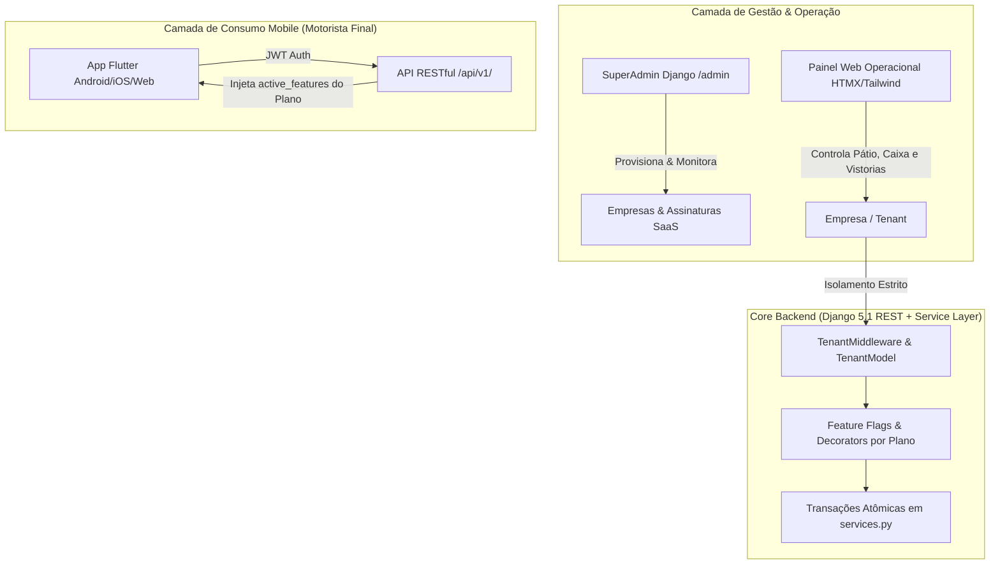

# 🚗 AutoFlow SaaS — Plataforma Multi-Tenant para Lava-Jato & Estética Automotiva

[](https://www.python.org/)
[](https://www.djangoproject.com/)
[](https://www.django-rest-framework.org/)
[](https://flutter.dev/)
[](https://tailwindcss.com/)
[](https://htmx.org/)
[](https://www.docker.com/)
[](https://www.postgresql.org/)
[](https://docs.pytest.org/)

Uma solução completa de software como serviço (**SaaS Multi-Tenant**) projetada para modernizar a gestão de lava-jatos rápidos, centros de estética automotiva e oficinas de detalhamento (*car detailing*), integrando **gestão operacional web reativa**, **motor financeiro com DRE**, **faturamento de frotas**, **clube de fidelidade** e **aplicativo mobile Flutter** para clientes e motoristas.

---

## 📌 Sumário

- [Visão Geral e Arquitetura](#-visão-geral-e-arquitetura)
- [Matriz de Planos e Feature Flags](#-matriz-de-planos-e-feature-flags)
- [Módulos do Sistema (`apps/`)](#-módulos-do-sistema-apps)
- [Stack Tecnológica](#-stack-tecnológica)
- [Estrutura do Projeto](#-estrutura-do-projeto)
- [Como Rodar o Projeto Backend](#-como-rodar-o-projeto-backend)
  - [Opção 1: Via Docker Compose (Recomendado)](#opção-1-via-docker-compose-recomendado)
  - [Opção 2: Instalação Local (Virtualenv)](#opção-2-instalação-local-virtualenv)
- [Como Rodar o Aplicativo Mobile Flutter](#-como-rodar-o-aplicativo-mobile-flutter)
- [Carga de Dados de Demonstração (Seed Data)](#-carga-de-dados-de-demonstração-seed-data)
- [Credenciais Pré-Configuradas](#-credenciais-pré-configuradas)
- [Suíte de Testes Automatizados](#-suíte-de-testes-automatizados)
- [Guia Detalhado de Engenharia](#-guia-detalhado-de-engenharia)

---

## 📐 Visão Geral e Arquitetura

O ecossistema é estruturado em três camadas complementares, garantindo separação rigorosa de responsabilidades e isolamento multi-inquilino (*multi-tenant*):



### Princípios de Engenharia Adotados:
1. **Multi-Tenancy por Coluna Discriminadora (`TenantModel`):** Todas as entidades operacionais herdam de `TenantModel` contendo `company_id`. O `TenantMiddleware` injeta o inquilino atual na requisição e impede vazamento de dados (*data leakage*).
2. **Service Layer Atômica (`services.py`):** Lógicas de negócio complexas que orquestram múltiplos modelos (ex: conclusão de OS disparando lançamento no Caixa, acúmulo de pontos de fidelidade e comissão do operador) residem em `services.py` sob blocos `with transaction.atomic()`.
3. **Resolução Dinâmica de Dependências:** Importações de serviços entre módulos irmãos utilizam resolução interna/lazy para evitar acoplamento cíclico.
4. **Interface Reativa Baseada em Planos:** O painel web e o app mobile adaptam seus botões, menus e ações em tempo de execução segundo as permissões ativas do plano contratado.

---

## 💎 Matriz de Planos e Feature Flags

O motor multi-tenant controla três planos comerciais com limites e funcionalidades escaláveis:

| Recurso / Feature Flag | Básico (Start)<br>`R$ 39,90/mês` | Profissional (Pro)<br>`R$ 79,90/mês` | Premium (Master)<br>`R$ 139,90/mês` |
| :--- | :---: | :---: | :---: |
| **Limite de Operadores** | 1 usuário | Até 3 usuários | Ilimitados (10+) |
| **Cadastro Clientes & Veículos** | ✅ | ✅ | ✅ |
| **Emissão de OS & Kanban Pátio** | ✅ | ✅ | ✅ |
| **Livro Caixa Básico** | ✅ | ✅ | ✅ |
| **Agendamento pelo App** (`has_mobile_booking`) | ✅ | ✅ | ✅ |
| **Programa de Fidelidade Digital** (`has_loyalty`) | ❌ | ✅ | ✅ |
| **Faturamento Mensal p/ Frotas** (`has_monthly_billing`) | ❌ | ✅ | ✅ |
| **Vistoria com Fotos Antes/Depois** (`has_inspections`) | ❌ | ❌ | ✅ |
| **Comissões de Funcionários** (`has_commissions`) | ❌ | ❌ | ✅ |
| **Notificações Push no App** (`has_push_notifications`) | ❌ | ❌ | ✅ |
| **Relatórios Gerenciais Avançados (DRE)** (`has_custom_reports`) | ❌ | ❌ | ✅ |

---

## 🧩 Módulos do Sistema (`apps/`)

| Módulo | Responsabilidade Principal |
| :--- | :--- |
| [`apps/saas_core`](apps/saas_core) | Modelos centrais de `Plan`, `Company`, `Subscription` e a classe abstrata `TenantModel` / Middleware. |
| [`apps/accounts`](apps/accounts) | Custom User Model (`User`), papéis de acesso (`superadmin`, `owner`, `employee`, `customer`) e fluxo de autenticação. |
| [`apps/customers`](apps/customers) | Cadastro de clientes (avulsos ou mensalistas) e veículos com identificação por placa e categoria. |
| [`apps/services`](apps/services) | Catálogo de serviços, categorias, preços padrão e tempo estimado de execução. |
| [`apps/orders`](apps/orders) | Gestão de Ordens de Serviço (OS), quadro Kanban de pátio e vistorias fotográficas (*checklist* antes/depois). |
| [`apps/finance`](apps/finance) | Livro caixa com controle de entradas/saídas, conciliação de pagamentos e DRE simplificado. |
| [`apps/loyalty`](apps/loyalty) | Regras de pontuação, extrato de pontos e resgate de recompensas para clientes frequentes. |
| [`apps/billing`](apps/billing) | Agrupamento de OSs de mensalistas para faturamento em lote com emissão de faturas corporativas. |
| [`apps/appointments`](apps/appointments) | Gestão de agendamentos de serviços pela web e aplicativo com prevenção de conflito de horários. |
| [`apps/employees`](apps/employees) | Gestão de colaboradores e operadores de pátio vinculados a cada empresa. |
| [`apps/commissions`](apps/commissions) | Regras de comissionamento (percentual ou fixo por serviço) e cálculo automático de fechamento. |
| [`apps/portal`](apps/portal) | Portal web do cliente para consulta de histórico, pontos de fidelidade e agendamentos. |
| [`apps/api`](apps/api) | Endpoints RESTful protegidos por SimpleJWT consumidos pelo aplicativo mobile Flutter. |

---

## 🛠️ Stack Tecnológica

### Backend & Web
- **Linguagem:** Python 3.12+
- **Framework:** Django 5.1+
- **API:** Django REST Framework (DRF) + `djangorestframework-simplejwt`
- **Frontend Web:** Django Templates + HTMX (interações dinâmicas SPA-like sem recarregar a página) + Tailwind CSS
- **Manipulação de Imagens:** Pillow (processamento de fotos de vistorias)
- **Banco de Dados:** PostgreSQL 16 (produção/Docker) / SQLite 3 (desenvolvimento local)

### Mobile
- **Framework:** Flutter 3.x (Dart)
- **Alvos:** Android, iOS e Web
- **Autenticação:** JWT Tokens armazenados com persistência segura
- **Funcionalidades:** Agendamento em tempo real, extrato do clube de fidelidade e acompanhamento de status do veículo no pátio.

### Infraestrutura & Testes
- **Containerização:** Docker e Docker Compose
- **Testes Automatizados:** Pytest, `pytest-django` e `factory-boy`

---

## 📁 Estrutura do Projeto

```text
.
├── apps/                    # Módulos de domínio da aplicação Django
│   ├── accounts/            # Autenticação e perfis de usuário
│   ├── api/                 # Endpoints REST para o App Mobile
│   ├── appointments/        # Agendamentos de serviços
│   ├── billing/             # Faturamento de clientes mensalistas/frotas
│   ├── commissions/         # Regras e extratos de comissões
│   ├── core/                # Utilitários e helpers transversais
│   ├── customers/           # Clientes e veículos
│   ├── employees/           # Colaboradores e operadores
│   ├── finance/             # Livro caixa e fluxo financeiro
│   ├── loyalty/             # Programa de fidelidade
│   ├── orders/              # Ordens de serviço e Kanban de pátio
│   ├── portal/              # Portal de autoatendimento do cliente
│   ├── saas_core/           # Núcleo multi-tenant e planos
│   └── services/            # Catálogo de serviços e preços
├── config/                  # Configurações globais do Django
│   ├── settings/            # base.py, local.py, production.py, test.py
│   ├── urls.py              # Roteamento global de URLs
│   └── wsgi.py / asgi.py
├── mobile_app/              # Código-fonte completo do App Flutter
│   ├── lib/                 # Telas, providers, models e services
│   └── pubspec.yaml
├── requirements/            # Dependências divididas por ambiente
│   ├── base.txt
│   ├── local.txt
│   └── production.txt
├── static/ & templates/     # Arquivos estáticos e templates HTMX
├── tests/                   # Suíte de testes automatizados com Pytest
├── Dockerfile               # Imagem da aplicação backend
├── docker-compose.yml       # Orquestração do Backend + PostgreSQL
├── manage.py                # Utilitário CLI do Django
├── seed_data.py             # Script de carga inicial de demonstração
├── pytest.ini               # Configurações de execução do Pytest
└── GUIA_PROJETO_DO_ZERO.md  # Guia mestre detalhado de arquitetura
```

---

## 🚀 Como Rodar o Projeto Backend

### Opção 1: Via Docker Compose (Recomendado)

1. **Clone o repositório:**
   ```bash
   git clone <URL_DO_REPOSITORIO>
   cd Daniel
   ```

2. **Copie o arquivo de variáveis de ambiente:**
   ```bash
   cp .env.example .env
   ```

3. **Suba os containers (PostgreSQL + Aplicação Django):**
   ```bash
   docker compose up --build -d
   ```

4. **Execute as migrações do banco de dados:**
   ```bash
   docker compose exec web python manage.py migrate
   ```

5. **Carregue os dados de demonstração (Seed Data):**
   ```bash
   docker compose exec web python seed_data.py
   ```

6. **Acesse no navegador:**
   - Painel Operacional: [http://localhost:8000/](http://localhost:8000/)
   - Django Admin: [http://localhost:8000/admin/](http://localhost:8000/admin/)
   - Documentação da API: [http://localhost:8000/api/v1/](http://localhost:8000/api/v1/)

---

### Opção 2: Instalação Local (Virtualenv)

1. **Crie e ative um ambiente virtual:**
   ```bash
   # Linux / macOS:
   python3 -m venv .venv
   source .venv/bin/activate

   # Windows (PowerShell):
   python -m venv .venv
   .venv\Scripts\Activate.ps1
   ```

2. **Instale as dependências de desenvolvimento:**
   ```bash
   pip install -r requirements/local.txt
   ```

3. **Execute as migrações (usando SQLite padrão para desenvolvimento):**
   ```bash
   python manage.py migrate
   ```

4. **Popule a base de dados com as empresas e planos de teste:**
   ```bash
   python seed_data.py
   ```

5. **Inicie o servidor de desenvolvimento:**
   ```bash
   python manage.py runserver
   ```
   Acesse: [http://127.0.0.1:8000/](http://127.0.0.1:8000/)

---

## 📱 Como Rodar o Aplicativo Mobile Flutter

O aplicativo mobile foi desenvolvido em Flutter e conecta-se à API REST do backend para permitir que os motoristas agendem serviços e acompanhem o status do seu veículo.

1. **Acesse a pasta do app:**
   ```bash
   cd mobile_app
   ```

2. **Instale as dependências:**
   ```bash
   flutter pub get
   ```

3. **Configure a URL base da API:**
   - Caso esteja testando no **Emulador Android**, aponte para: `http://10.0.2.2:8000/api/v1/`
   - Caso esteja testando no **Navegador Web / Desktop**: `http://localhost:8000/api/v1/`
   - Caso esteja testando em um **Aparelho Físico**: Utilize o IP local da sua máquina (ex: `http://192.168.1.50:8000/api/v1/`).

4. **Execute o aplicativo:**
   ```bash
   flutter run
   ```

---

## 🌱 Carga de Dados de Demonstração (Seed Data)

O projeto inclui o script [`seed_data.py`](seed_data.py), que provisiona instantaneamente:
- **3 Planos Comerciais:** Básico (Start), Profissional (Pro) e Premium (Master).
- **SuperAdmin Geral do SaaS.**
- **3 Empresas de Exemplo:**
  1. *Lava-Jato Central* (Plano Básico)
  2. *Pro Wash Detail* (Plano Pro)
  3. *Auto Brilho VIP Detail* (Plano Premium)
- Serviços cadastrados com tabelas de preços, regras de comissionamento e programas de fidelidade.
- Clientes, frotas, veículos cadastrados e Ordens de Serviço em andamento no pátio.

Para rodar a qualquer momento:
```bash
python seed_data.py
```

---

## 🔑 Credenciais Pré-Configuradas

Após rodar o script `seed_data.py`, utilize as seguintes credenciais para acessar os diferentes níveis do sistema:

| Papel / Perfil | E-mail de Acesso | Senha | Empresa Vinculada | Plano Ativo |
| :--- | :--- | :--- | :--- | :--- |
| **SuperAdmin SaaS** | `admin@saas.com` | `admin` | Gestão Global (`/admin`) | Master Total |
| **Dono (Premium)** | `dono@autobrilho.com` | `dono` | Auto Brilho VIP Detail | Premium (Master) |
| **Operador de Pátio** | `lavador@autobrilho.com` | `dono` | Auto Brilho VIP Detail | Premium (Master) |
| **Dono (Profissional)** | `dono.pro@teste.com` | `dono` | Pro Wash Detail | Profissional (Pro) |
| **Dono (Básico)** | `dono.basico@teste.com` | `dono` | Lava-Jato Central | Básico (Start) |
| **Cliente / Motorista** | `cliente@autoflow.com` | `123` | Auto Brilho VIP (App/Portal) | Cliente Final |

---

## 🧪 Suíte de Testes Automatizados

Os testes cobrem regras críticas de negócio (isolamento de tenants, transações financeiras atômicas, cálculo de comissões e faturamento mensal).

Para rodar a suíte completa com Pytest:
```bash
pytest
```

Para rodar testes com relatório detalhado ou direcionado a um módulo específico:
```bash
# Execução verbosa
pytest -v

# Apenas módulo de ordens de serviço
pytest apps/orders/tests/

# Apenas módulo de controle multi-tenant
pytest apps/saas_core/tests/
```

---

## 📖 Guia Detalhado de Engenharia

Para entender a fundo como cada classe, serviço atômico, interceptor multi-tenant e contrato de API foram concebidos, consulte o documento completo:

👉 **[GUIA_PROJETO_DO_ZERO.md](GUIA_PROJETO_DO_ZERO.md)**

---

<p align="center">
  Desenvolvido com foco em alta escalabilidade, isolamento de dados e excelência na experiência do usuário.
</p>
